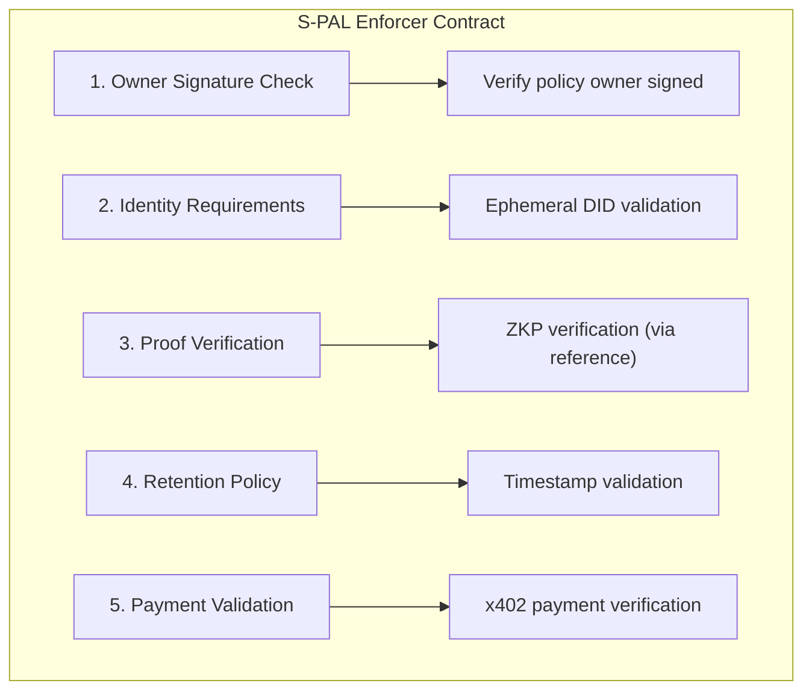

# PCI Contracts

Layer 3: Cardano smart contracts for S-PAL policy enforcement using Aiken.

## Overview

PCI Contracts provides:

- **S-PAL Enforcement** - Cryptographic enforcement of privacy policies
- **Policy Validation** - On-chain validation of access rules
- **Identity Verification** - DID-based identity checks
- **Payment Handling** - Micropayment validation for x402

## Installation

```bash
pnpm add pci-contracts
```

## Quick Start

```typescript
import { SPALEnforcer, compileValidator } from "pci-contracts";

// Compile the validator
const compiled = await compileValidator();

// Create an enforcer instance
const enforcer = new SPALEnforcer(compiled);

// Validate a policy interaction
const result = await enforcer.validate({
  policyId: "spal:did:pci:...",
  requesterDid: "did:pci:ephemeral:...",
  contextScope: "medical/allergies",
  proofs: [...],
});
```

## Architecture

The S-PAL Enforcer contract validates:



## Contract Language

Contracts are written in Aiken, a functional language for Cardano:

```aiken
// Example S-PAL validator in Aiken
validator spal {
  spend(
    datum: Option<PolicyDatum>,
    redeemer: AccessRedeemer,
    _utxo: OutputReference,
    tx: Transaction,
  ) {
    when datum is {
      Some(policy) -> {
        let owner_signed = check_owner_signature(tx, policy.owner)
        let ephemeral_valid = check_ephemeral_did(
          redeemer.requester_did,
          policy.requires_ephemeral_did,
        )
        owner_signed && ephemeral_valid
      }
      None -> False
    }
  }
}
```

## Development

### Prerequisites

1. **Aiken** - Cardano smart contract language
2. **Docker** and **Docker Compose** (for local Cardano devnet)
3. **Node.js 18+** and **pnpm** (for TypeScript SDK)

### Install Aiken

```bash
# Install via aikup (recommended)
curl --proto '=https' --tlsv1.2 -LsSf https://install.aiken-lang.org | sh
source ~/.aiken/bin/env
aikup

# Verify installation
aiken --version
```

### Run Local Cardano Devnet (Yaci DevKit)

```bash
# Install Yaci DevKit
curl -sSL https://devkit.yaci.xyz/install.sh | bash
source ~/.zshrc  # or ~/.bashrc

# Start devkit containers
devkit start

# Create and start a devnet
devkit create-node -o --start

# This provides:
# - Cardano node (localhost:3001)
# - Submit API (localhost:8090)
# - Yaci Store API (localhost:8080)
# - Yaci Viewer (localhost:5173)
# - Ogmios (localhost:1337)
# - Kupo (localhost:1442)
```

### Build and Test Contracts

```bash
# Navigate to Aiken project
cd spal_validator

# Check contract syntax
aiken check

# Build contract (generates Plutus script)
aiken build

# Run tests
aiken check  # includes test execution

# View generated blueprint
cat plutus.json
```

### Build TypeScript SDK

```bash
# Install dependencies
pnpm install

# Compile contracts
pnpm compile

# Run tests
pnpm test

# Build for distribution
pnpm build
```

### Verify Cardano Devnet is Running

```bash
# Check blocks are being produced
curl http://localhost:8080/api/v1/blocks

# Check node sync status
curl http://localhost:8080/api/v1/epochs/latest
```

## Related Packages

- [pci-spec](https://github.com/peteski22/pci-spec) - S-PAL schema and protocols
- [pci-context-store](https://github.com/peteski22/pci-context-store) - Layer 1: Context Store
- [pci-agent](https://github.com/peteski22/pci-agent) - Layer 2: Personal Agent
- [pci-zkp](https://github.com/peteski22/pci-zkp) - Layer 4: Zero-Knowledge Proofs

## License

Apache 2.0
