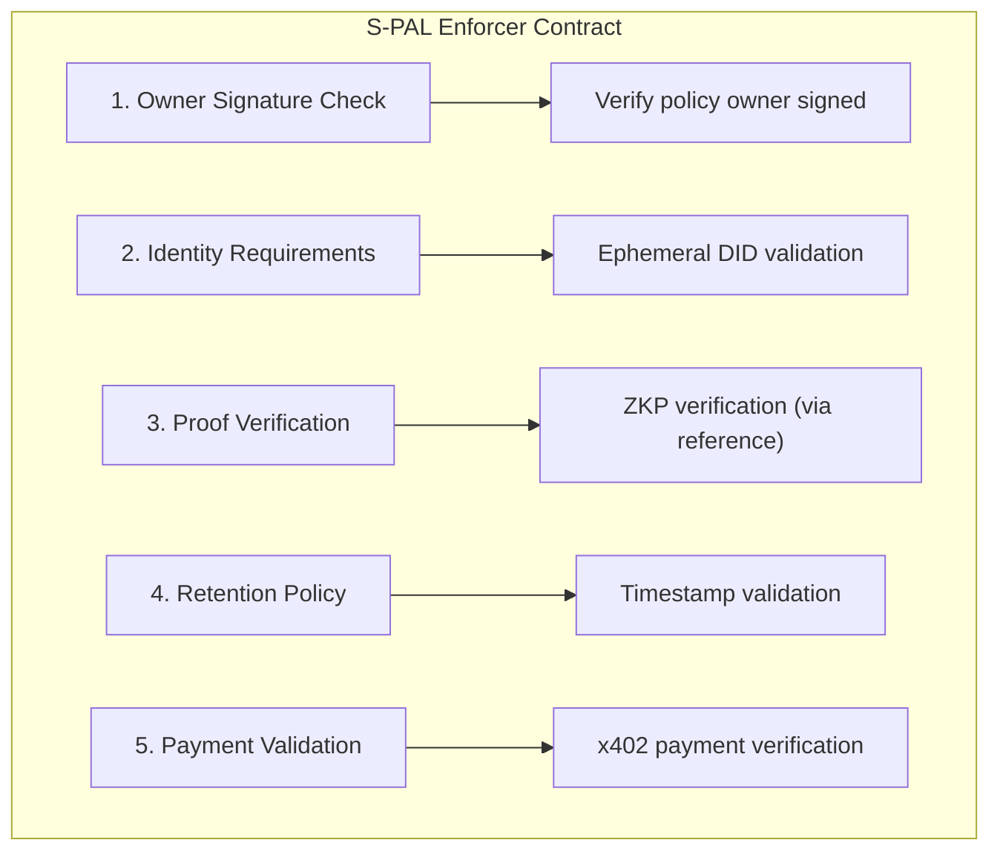

# PCI Contracts

Layer 3: Cardano smart contracts for S-PAL policy enforcement using Helios.

## Overview

PCI Contracts provides:

- **S-PAL Enforcement** - Cryptographic enforcement of privacy policies
- **Policy Validation** - On-chain validation of access rules
- **Identity Verification** - DID-based identity checks
- **Payment Handling** - Micropayment validation for x402

## Installation

```bash
pnpm add pci-contracts
```

## Quick Start

```typescript
import { SPALEnforcer, compileValidator } from "pci-contracts";

// Compile the validator
const compiled = await compileValidator();

// Create an enforcer instance
const enforcer = new SPALEnforcer(compiled);

// Validate a policy interaction
const result = await enforcer.validate({
  policyId: "spal:did:pci:...",
  requesterDid: "did:pci:ephemeral:...",
  contextScope: "medical/allergies",
  proofs: [...],
});
```

## Architecture

The S-PAL Enforcer contract validates:



## Contract Language

Contracts are written in Helios, a TypeScript-like language for Cardano:

```typescript
// Example S-PAL validator in Helios
spending spal_enforcer

struct Policy {
    owner: PubKeyHash
    max_retention: Int
    requires_payment: Int
}

func main(policy: Policy, ctx: ScriptContext) -> Bool {
    // Validate owner signature
    ctx.tx.is_signed_by(policy.owner) &&
    // Additional validation...
    true
}
```

## Development

```bash
# Install dependencies
pnpm install

# Compile contracts
pnpm compile

# Run tests
pnpm test

# Build for distribution
pnpm build
```

## Related Packages

- [pci-spec](https://github.com/peteski22/pci-spec) - S-PAL schema and protocols
- [pci-context-store](https://github.com/peteski22/pci-context-store) - Layer 1: Context Store
- [pci-agent](https://github.com/peteski22/pci-agent) - Layer 2: Personal Agent
- [pci-zkp](https://github.com/peteski22/pci-zkp) - Layer 4: Zero-Knowledge Proofs

## License

Apache 2.0
